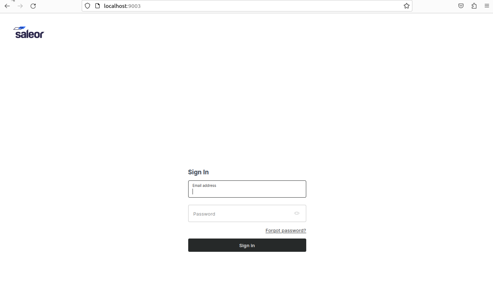

# ISEC6000_assessment1 
# Task2: Microservices Architecture and Deployment

## 3. saleor plateform repo steps to run a saleor stack
### To clone the repository, run the following command

    $ git clone https://github.com/saleor/saleor-platform.git 

### Go to the cloned dir

    $ cd saleor-platform

### Build the application

    $ docker compose build

### Apply Django migration

    $ docker compose run --rm api python3 manage.py migrate

### Populate the database with example data and create the admin user:

    $ docker compose run --rm api python3 manage.py populatedb --createsuperuser

### Run the app

    $ docker compose up

## Where is the application running?
- Saleor Core (API) - http://localhost:8000

- Saleor Dashboard - http://localhost:9003

- Jaeger UI (APM) - http://localhost:16686

- Mailpit (Test email interface) - http://localhost:8025

## 4. Tailor the compose file to ensure optimal functionality

